# kingshard的性能测试
## 1.测试环境
### 1.1服务器配置

|类别|名称|
|---|---|
|OS       |云主机 Ubuntu 14.04 LTS|
|CPU      |Common KVM CPU @ 2.40GHz *4|
|RAM      |8GB|
|DISK     |500GB|
|kingshard|master分支|
|Mysql    |v5.6.25|
|Sysbench |v0.5|

## 2.性能需求

1. 测试通过kingshard转发SQL请求与直连DB发送SQL请求这两种情形下的性能差距。
2. 测试配置文件中max_conns_limit参数对kingshard的影响，并找出最优值。

## 3.测试准备工作
### 3.1 kingshard性能测试环境搭建
利用上述配置的4台服务器搭建了一个kingshard性能测试环境：

* 服务器A运行着sysbench
* 服务器B运行着kingshard系统
* 服务器C运行着主库
* 服务器D运行着从库

四台服务器处在同一个网段中。具体的拓扑图如下所示：

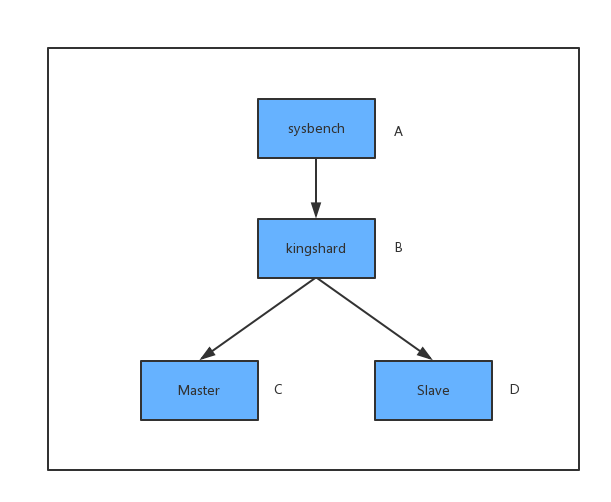

有关kingshard系统安装与配置，请参考文档[安装kingshard](./kingshard_install_document.md)。  
有关sysbench v0.5的安装与命令选项，请参考[sysbench](https://github.com/akopytov/sysbench)。

## 4.测试过程
执行下面的命令准备测试数据

```sh
time sysbench --test=/data/home/test_user/software/sysbench/sysbench/tests/db/oltp.lua \
              --mysql-host=host \
              --mysql-port=9696 \
              --mysql-user=kingshard \
              --mysql-password=kingshard \
              --mysql-db=kingshard \
              --oltp-tables-count=1 \
              --oltp-table-size=1000000 \
              --num-threads=50 \
              --max-requests=1000000 \
              --report-interval=1 \
              prepare
```

上述命令会创建表sbtest1，数据量为100w，建表语句如下:

```sql
CREATE TABLE `sbtest1` (
  `id` int(10) unsigned NOT NULL AUTO_INCREMENT,
  `k` int(10) unsigned NOT NULL DEFAULT '0',
  `c` char(120) NOT NULL DEFAULT '',
  `pad` char(60) NOT NULL DEFAULT '',
  KEY `xid` (`id`),
  KEY `k_1` (`k`)
) ENGINE=InnoDB AUTO_INCREMENT=1000001 DEFAULT CHARSET=utf8 MAX_ROWS=1000000;
```

### 4.1 kingshard与直连DB性能比较
利用sysbench测试通过kingshard转发SQL请求和直连DB发送SQL请求这两种情况下，kingshard和Mysql系统的两项数据指标：**QP**S和每条**SQL请求平均处理时间**。  
通过sysbench发送四类SQL请求：select、update、insert和delete，场景分别为只读、读写4比1和只写。

#### 4.1.1 kingshard与直连DB只读比较

通过修改host、port执行下面的命令分别测试kingshard转发SQL或直连DB：

```sh
time sysbench --test=/data/home/test_user/software/sysbench/sysbench/tests/db/select.lua \
              --mysql-host=host \
              --mysql-port=9696 \
              --mysql-user=kingshard \
              --mysql-password=kingshard \
              --mysql-db=kingshard \
              --oltp-tables-count=1 \
              --oltp-table-size=1000000 \
              --num-threads=16 \
              --max-requests=1000000 \
              --report-interval=1 \
              --max-time=20 \
              run
```

利用sysbench测试了并发线程个数不同的情况下，分别执行最大请求次数为100w的 select操作,通过修改--num-threads可以获得不同并发线程数。  
测试连接 kingshard 和直连 DB 这两种情况下的 QPS（**QPS越大，系统性能越好**），
测试连接 kingshard 和直连 DB 这两种情况下的 执行sql平均时延（**时延越小，系统性能越好**），
每组数据重复测试三次后取平均值，具体数据对比如下表所示：

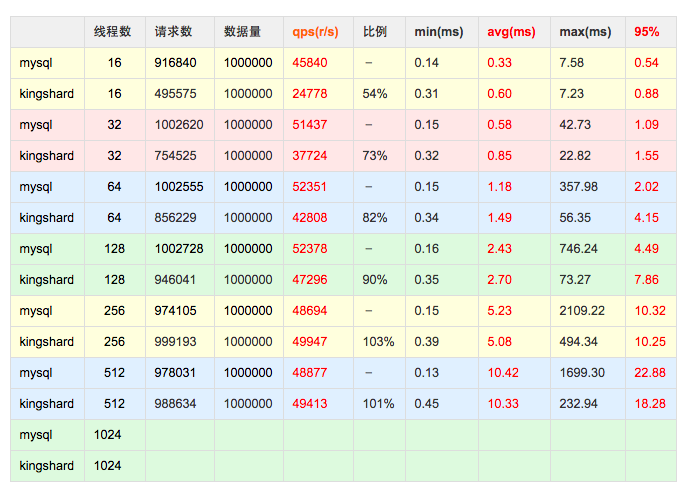

上表对应的QPS折线图如下所示：

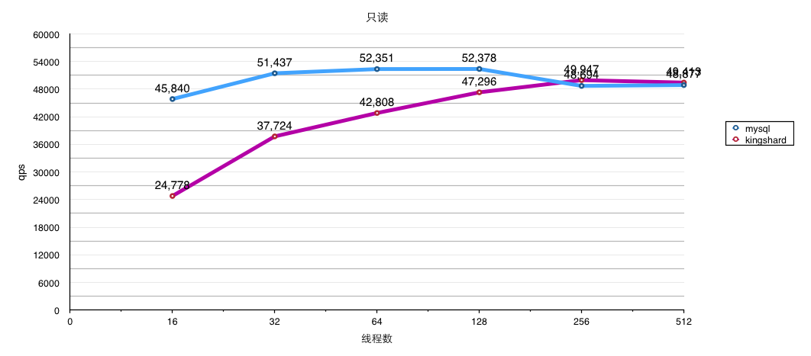

上表对应的时延折线图如下所示：

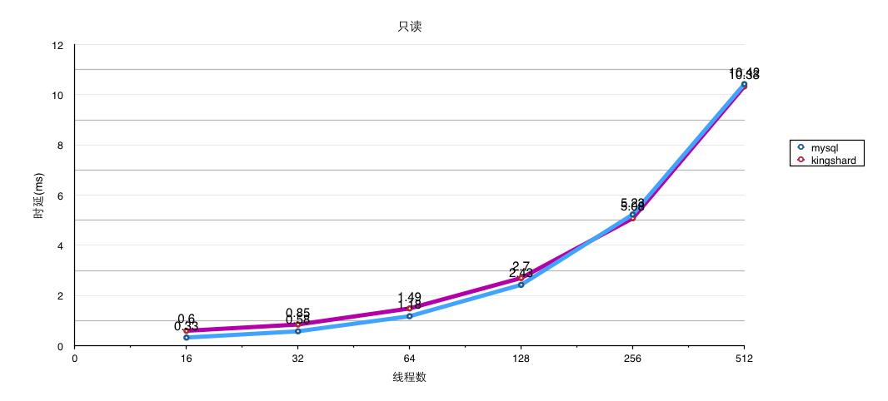

#### 4.1.2 kingshard与直连DB读写4:1比较

通过修改host、port执行下面的命令分别测试kingshard转发SQL或直连DB：

```sh
ysbench --test=/data/home/test_user/software/sysbench/sysbench/tests/db/oltp.lua \
              --mysql-host=host \
              --mysql-port=3306 \
              --mysql-user=kingshard \
              --mysql-password=ks \
              --mysql-db=kingshard \
              --oltp-tables-count=1 \
              --oltp-table-size=1000000 \
              --num-threads=16 \
              --max-requests=1000000 \
              --report-interval=1 \
              --max-time=20 \
              run
```

利用sysbench测试了并发线程个数不同的情况下，分别执行最大请求次数为100w的 select、update、insert、delete等混合操作,通过修改--num-threads可以获得不同并发线程数。  
测试连接 kingshard 和直连 DB 这两种情况下的 QPS（**QPS越大，系统性能越好**），
测试连接 kingshard 和直连 DB 这两种情况下的 执行sql平均时延（**时延越小，系统性能越好**），
每组数据重复测试三次后取平均值，具体数据对比如下表所示：

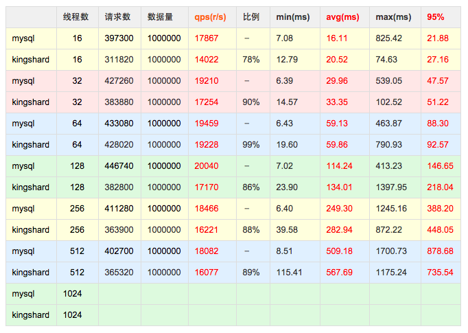

上表对应的QPS折线图如下所示：

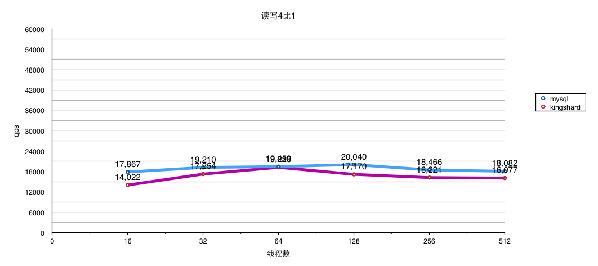

上表对应的时延折线图如下所示：

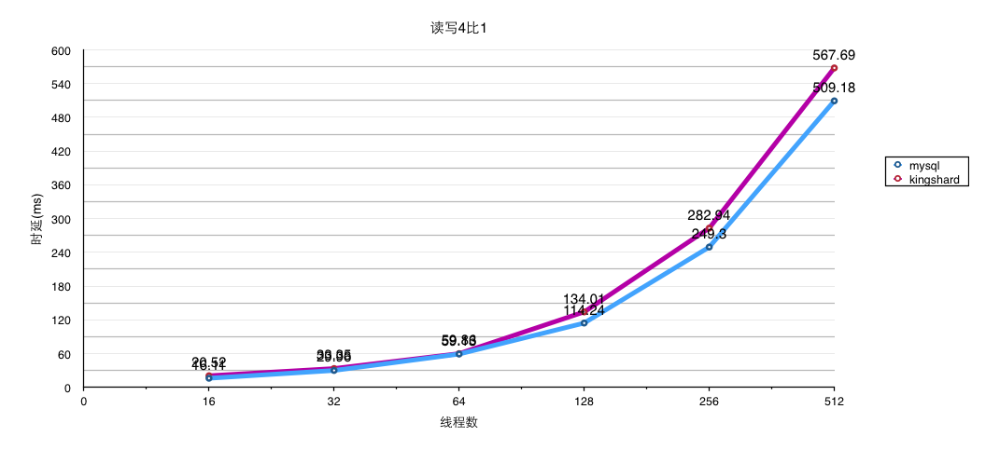

#### 4.1.3 kingshard与直连DB只写比较

通过修改host、port执行下面的命令分别测试kingshard转发SQL或直连DB：

```sh
time sysbench --test=/data/home/test_user/software/sysbench/sysbench/tests/db/insert.lua \
              --mysql-host=host \
              --mysql-port=3306 \
              --mysql-user=kingshard \
              --mysql-password=ks \
              --mysql-db=kingshard \
              --oltp-tables-count=1 \
              --oltp-table-size=1000000 \
              --num-threads=16 \
              --max-requests=1000000 \
              --report-interval=1 \
              --max-time=20 \
              run
```

利用sysbench测试了并发线程个数不同的情况下，分别执行最大请求次数为100w的insert操作,通过修改--num-threads可以获得不同并发线程数。  
测试连接 kingshard 和直连 DB 这两种情况下的 QPS（**QPS越大，系统性能越好**），
测试连接 kingshard 和直连 DB 这两种情况下的 执行sql平均时延（**时延越小，系统性能越好**），
每组数据重复测试三次后取平均值，具体数据对比如下表所示：

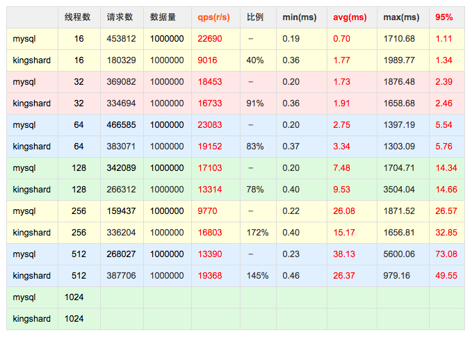

上表对应的QPS折线图如下所示：

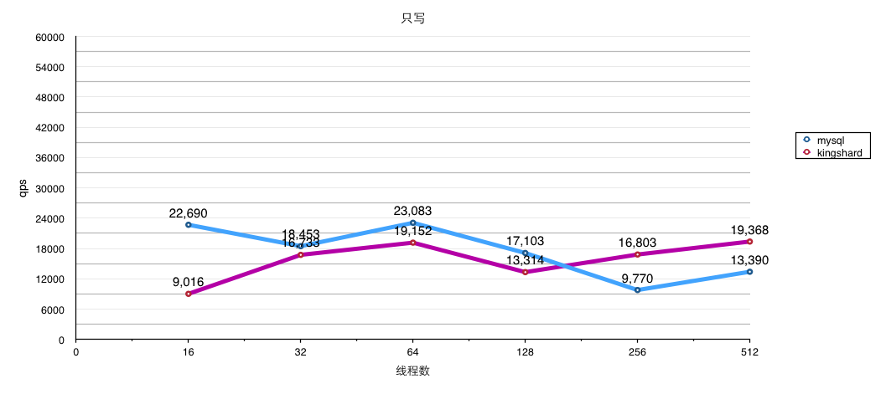

上表对应的时延折线图如下所示：

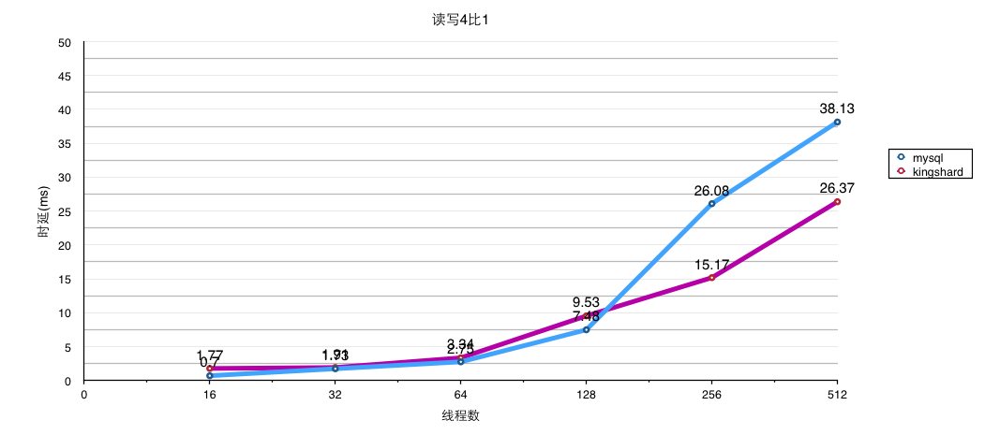


**从QPS折线图可以看出，当sysbench的并发测试线程较少时，连接kingshard和直连DB的QPS差距较大。
这主要是因为当sysbench并发线程少时，kingshard的性能没有得到充分的发挥，
sysbench只有很少的线程向kingshard发送请求，此时网络延迟对QPS的影响是最主要的。**

**当sysbench的并发测试线程较大时，此时kingshard的性能就得到了充分的发挥，
QPS的对比是连接kingshard与直连DB性能对比的真实的反应，网络延迟对QPS的影响作用就显得很小了。**

**从以上几个表个的比例数据来看，通过kingshard转发select请求时的QPS是直连DB时80%左右，
而update和insert请求对应的QPS则更高一些，相当于直连DB时的85%左右,甚至在并发更高的情况下直连mysql的性能低于通过kingshards转发的性能。
由此看来利用kingshard转发SQL请求带来的性能下降虽有下降，但完全可以接受，甚至高并发场景下kingshard的性能优于直连DB的性能。**

**sysbench并发线程高于512的数据并没有给出，因为直连DB已经不能正常完成测试，但是kingshard可以完成。**

### 4.2 max_conns_limit参数对kingshard性能影响

max_conns_limit 是 kingshard 初始化时创建的与后端mysql长连接个数，这个值设置的不同对 kingshard 性能也有比较明显的影响。
我们猜测max_conns_limit除了与**kingshard所在主机CPU核心数**有关外还与**后端mysql能接纳的连接数**有关。
我们分别测试将 max_conns_limit 设置为16、32、64、128、256、512时，kingshard转发select，update和insert三类操作请求时的 QPS，
SQL的混合情况为读写4比1，且sysbench的不同sql分别处于不同的事务中，具体对比结果如下所述：


上数测试对应的QPS折线图如下所示：

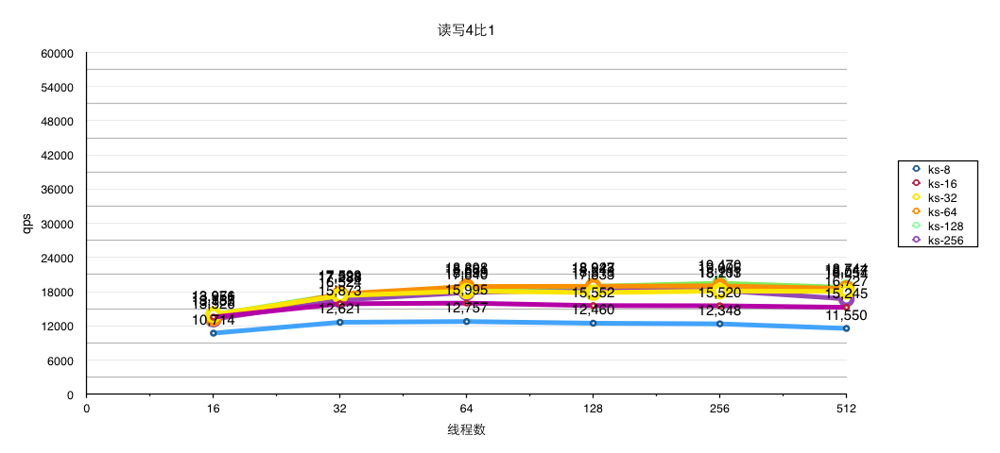


**从kingshard处理三类SQL操作的QPS对比来看，将max_conns_limit参数设置为128左右较为合理, 高于128后通过提高max_conns_limit值并没有显著效果。**

**max_conns_limit参数值与kingshard所在主机核心数并没有必然的联系，与后端mysql主机可承受连接数关系密切。**

## 5.测试结论

本文主要测试了通过kingshard转发SQL请求与直连DB发送SQL请求这两种情形下的性能差距，和max_conns_limit值对kingshard的性能影响。  
ks的读写性能平均可以达到原生mysql性能的80%，一定条件下可以达到90%，随着并发数的增加甚至能超越mysql本身。  
ks可以对mysql形成保护，增加了ks后，db层对外表现出可以接收更高的并发数，且执行时间长短不同的sql使用各自的资源，形成了资源隔离，mysql不会出现性能毛刺。  
综合以上测试结果来看，kingshard性能表现较为优秀，并没有明显的性能下降。**同时在测试中发现kingshard系统属于CPU密集型任务，相对于磁盘IO和内存占用率而言，kingshard对CPU消耗显得最为明显，所以建议在部署kingshard的时候需要优先考虑服务器的CPU性能。**
